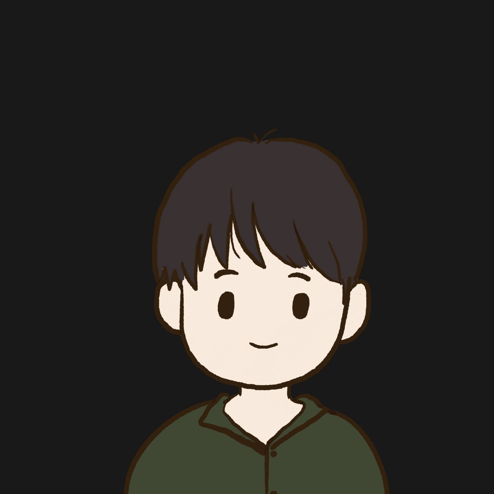

# 📚 Portfolio

<p align="center">
  
</p>

Currently sort by time. ⏲

```json
"skills_tags": {
  "🎮": "Game (Design & Development)",
  "💻": "Web",
  "📱": "UI/UX",
  "👨‍💼": "Project Management",
}
```

## 🎮 Space Shooter Game

> Student Project

**🚀 Skills:** 🎮 <br>
**🟢 Status:** Done! <br>
**📝 Description:** Space shooting game project for used in IT Camp 12. A game that player take role of spaceship that have a mission to defend Earth from asteriods, game will over if player health or earth health is 0.
